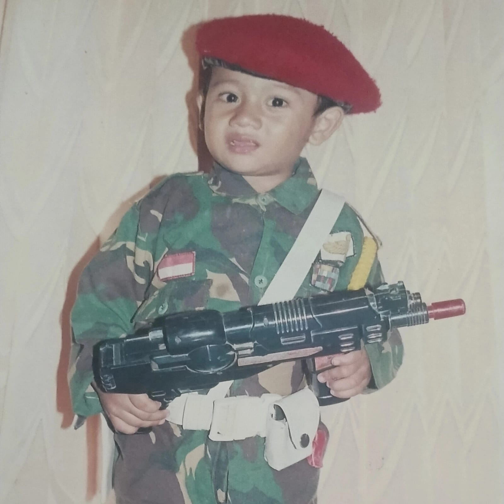

<!DOCTYPE html>
<html lang="id">
<head>
    <meta charset="UTF-8">
    <meta name="viewport" content="width=device-width, initial-scale=1.0">
    <title>Bio Data - wahyu</title>
    <link rel="stylesheet" href="https://cdnjs.cloudflare.com/ajax/libs/font-awesome/6.4.0/css/all.min.css">
    
</head>
<body>
    

        <header>
            
            <h1>wahyu aditia putra</h1>
            
in engineering we trust, smart guy will always be the top tier of our type

           
        </header>

        

            <section class="section">
                <h2><i class="fas fa-user"></i> Informasi Personal</h2>
                

                    

                        

                            <i class="fas fa-id-card"></i> Nama Lengkap
                        

                        
wahyu aditia putra

                    

                    

                        

                            <i class="fas fa-birthday-cake"></i> Tempat, Tanggal Lahir
                        

                        
Surabaya, 23 februari 2006

                    

                    

                        

                            <i class="fas fa-map-marker-alt"></i> Alamat
                        

                        
tambak gringsing baru

                    

                    

                        

                            <i class="fas fa-heart"></i> Status
                        

                        
solo

                    

                

            </section>

            <section class="section">
                <h2><i class="fas fa-info-circle"></i> Tentang Saya</h2>
                

                    saya adalah mahasiswa itats yg baru masuk kuliah sebelum kuliah saya sekolah di smk rajasa Surabaya
                    saya masuk itats karena rekomendasi dari orang tua saya yg alumni itats 2005
                

            </section>

            <section class="section">
                <h2><i class="fas fa-code"></i> Keahlian</h2>
                

                    HTML
                    CSS
                    PYTON
                

            </section>

            <section class="section">
                <h2><i class="fas fa-briefcase"></i> Pengalaman Kerja</h2>
                

                    

                        
pengalaman magang

                        
dinas pendidikan provinsi jatim

                        
2024 - 2025

                    

                  
                

            </section>

            <section class="section">
                <h2><i class="fas fa-graduation-cap"></i> Pendidikan</h2>
                

                    

                        
S1 Teknik Informatika

                        
institut teknologi adhi tama Surabaya

                        
2025

                    

                

            </section>

      

        <footer>
            
&copy; 2025 wahyu aditia putra. All rights reserved.

            

                <a href="#">Privacy Policy</a>
                <a href="#">Terms of Service</a>
                <a href="#">Sitemap</a>
            

        </footer>
    

    
</body>
</html>
